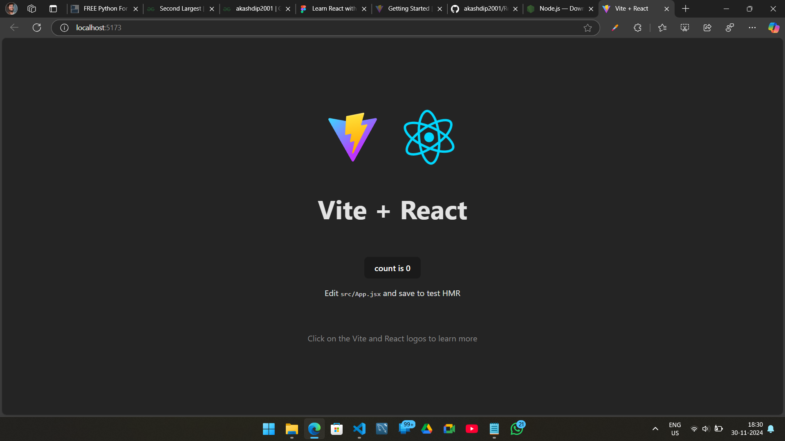
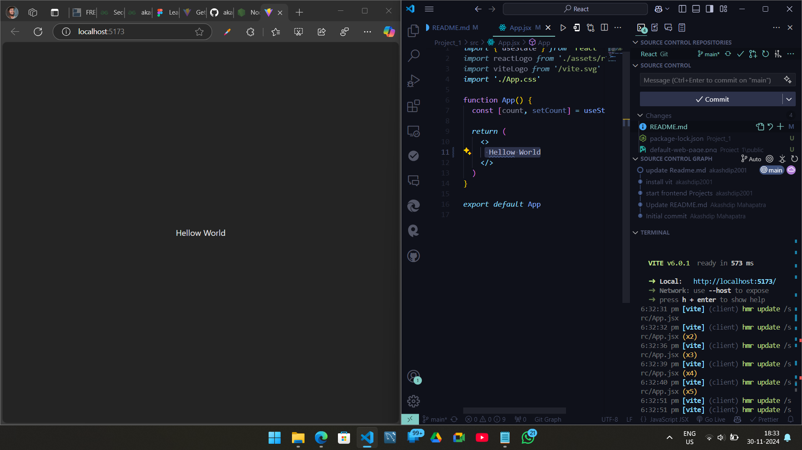
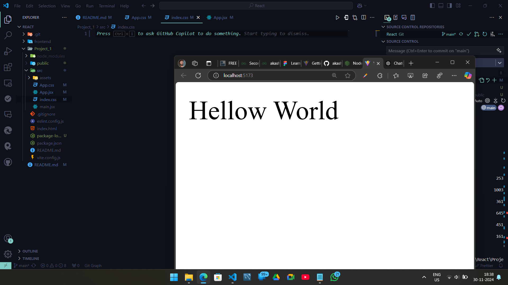

# React + Vite


This template provides a minimal setup to get React working in Vite with HMR and some ESLint rules.

Currently, two official plugins are available:

- [@vitejs/plugin-react](https://github.com/vitejs/vite-plugin-react/blob/main/packages/plugin-react/README.md) uses [Babel](https://babeljs.io/) for Fast Refresh
- [@vitejs/plugin-react-swc](https://github.com/vitejs/vite-plugin-react-swc) uses [SWC](https://swc.rs/) for Fast Refresh

---

# React

| [React install guide](https://react.dev/learn/start-a-new-react-project) | [use Vite](https://vite.dev/) |
| ------------------------------------------------------------------------ | ----------------------------- |

## Step 1

| [install Node.js](https://nodejs.org/en/download/prebuilt-installer) |

#### output

```bash
PS C:\Users\akash\Desktop\Py Projects\React> node --version
v22.11.0
PS C:\Users\akash\Desktop\Py Projects\React>
```

## Step 2

```bash
npm create vite@latest
```

#### output

```bash
PS C:\Users\akash\Desktop\Py Projects\React> npm create vite@latest
Need to install the following packages:
create-vite@6.0.1
Ok to proceed? (y) y


> npx
> create-vite

√ Project name: ... Project_1
√ Package name: ... project-1
√ Select a framework: » React
√ Select a variant: » JavaScript

Scaffolding project in C:\Users\akash\Desktop\Py Projects\React\Project_1...

Done. Now run:

  cd Project_1
  npm install
  npm run dev

PS C:\Users\akash\Desktop\Py Projects\React>
```

## Explain the stricture

- `src/main.jsx` is the main file can `import and build` everything --> and Render in `index.html` `id=Root` part.

- `Package.json` is record all dependencies & versions.

## Run the project

```bash
cd Project_1
npm run dev
```

If the project not Run, its good chance you not install all packages which already written in `Package.json` file. just run the command to install.

```bash
npm i
```

```bash
npm run dev
```

click the local URL and open the web-page. every component in this webpage is come from `App.jsx` file.

<div style="display: flex; justify-content: space-between;">
  
  
</div>
<div style="display: flex; justify-content: space-between;">
  
  
</div>

Then remove all tsx (exact like HTML) only type `Hello World` , And Remove all `css` files.
