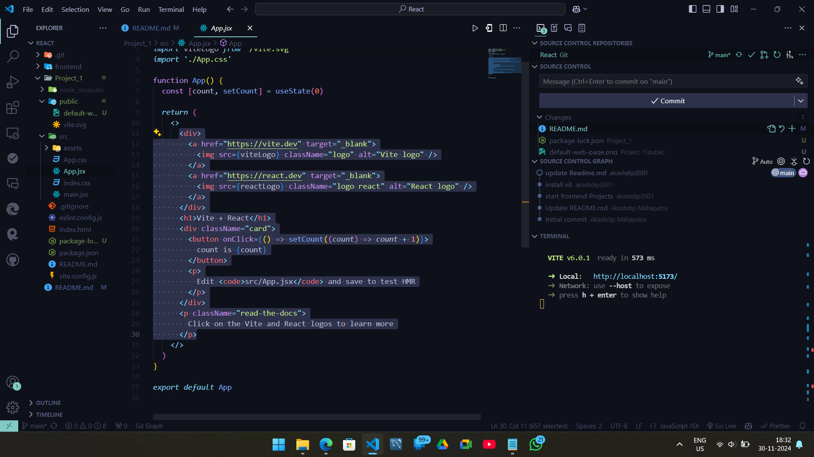

# React + Vite


This template provides a minimal setup to get React working in Vite with HMR and some ESLint rules.

Currently, two official plugins are available:

- [@vitejs/plugin-react](https://github.com/vitejs/vite-plugin-react/blob/main/packages/plugin-react/README.md) uses [Babel](https://babeljs.io/) for Fast Refresh
- [@vitejs/plugin-react-swc](https://github.com/vitejs/vite-plugin-react-swc) uses [SWC](https://swc.rs/) for Fast Refresh

---

# React

| [React install guide](https://react.dev/learn/start-a-new-react-project) | [use Vite](https://vite.dev/) |
| ------------------------------------------------------------------------ | ----------------------------- |

## Step 1

| [install Node.js](https://nodejs.org/en/download/prebuilt-installer) |

#### output

```bash
PS C:\Users\akash\Desktop\Py Projects\React> node --version
v22.11.0
PS C:\Users\akash\Desktop\Py Projects\React>
```

## Step 2

```bash
npm create vite@latest
```

#### output

```bash
PS C:\Users\akash\Desktop\Py Projects\React> npm create vite@latest
Need to install the following packages:
create-vite@6.0.1
Ok to proceed? (y) y


> npx
> create-vite

√ Project name: ... Project_1
√ Package name: ... project-1
√ Select a framework: » React
√ Select a variant: » JavaScript

Scaffolding project in C:\Users\akash\Desktop\Py Projects\React\Project_1...

Done. Now run:

  cd Project_1
  npm install
  npm run dev

PS C:\Users\akash\Desktop\Py Projects\React>
```

## Explain the stricture

- `src/main.jsx` is the main file can `import and build` everything --> and Render in `index.html` `id=Root` part.

- `Package.json` is record all dependencies & versions.

## Run the project

```bash
cd Project_1
npm run dev
```

If the project not Run, its good chance you not install all packages which already written in `Package.json` file. just run the command to install.

```bash
npm i
```

```bash
npm run dev
```

click the local URL and open the web-page. every component in this webpage is come from `App.jsx` file.

<div style="display: flex; justify-content: space-between;">
  
  
</div>
<div style="display: flex; justify-content: space-between;">
  
  
</div>

Then remove all tsx (exact like HTML) only type `Hello World` , And Remove all `css` files.

Remove: App.jsx
Remove: App.css
Remove: index.css
modified: Main.jsx

```jsx
createRoot(document.getElementById("root")).render(
  <StrictMode>Hello World</StrictMode>
);
```

---

Its a function:
```go
const app = () => {
}
```
But its a component:
```go
const App = () => {
}
```

---

## Create a component in `App.jsx`

```jsx
const App = () => {
    return (
        <div>
            <h1>My first Component</h1>
        </div>
    );
};
// 1.1 This is the default export of the App component
// 1.1 so that it can be imported in other files
export default App;
```
### use the component in `main.jsx` for `Render`

```jsx
import React from "react";
import { createRoot } from "react-dom/client";
import App from "./App"; // 1.1 Import the App component from the App.jsx file

createRoot(document.getElementById("root")).render(
  <React.StrictMode>
    <div>Hello World</div>
    <App /> {/* // 1.1 Render the App component as a jsx element */}
  </React.StrictMode>
);
```
## Add Css

| [Google Font](https://fonts.google.com/selection/embed) |
| --- |

```css
@import url('https://fonts.googleapis.com/css2?family=Poppins:ital,wght@0,100;0,200;0,300;0,400;0,500;0,600;0,700;0,800;0,900;1,100;1,200;1,300;1,400;1,500;1,600;1,700;1,800;1,900&display=swap');

```
### use font Family

```go
font-family: "Poppins", serif;
```
### and use it in `App.css` file
```css
body {
  font-family: 'Poppins', sans-serif;
  margin: 0;
  padding: 0;
  box-sizing: border-box;
}
```

### impost the css in `App.jsx` (its a Global variable U can use it everywhere)

```jsx
import "./App.css";
```

---

### Break components in another `.jsx` file

```yaml
Project_1
│
│── node_module
│── src
│     │
.     │── App.jsx
.     └── Component:
          │
          │── Navigation.jsx:
          └── ... 
```

<div style="display: flex; justify-content: space-between;">
  
  
</div>